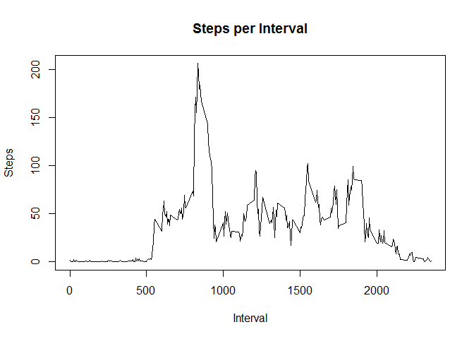
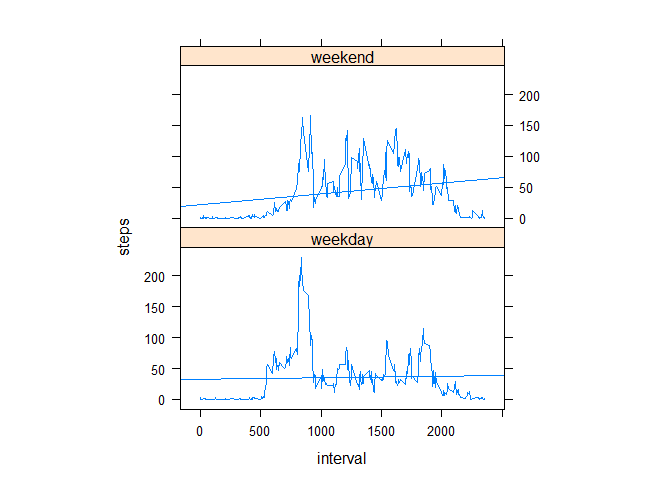

# Reproducible Research: Peer Assessment 1

In this assessment we will try to answer some questions about data obtained from a personal activity monitoring device. The data consists of two months of data from an anonymous individual collected during the months of October and November, 2012 and include the number of steps taken in 5 minute intervals each day. 


## Loading and preprocessing the data

After placing the provided files in the working directory the data can be unzipped and loaded. The preprocessing of the data will be done on a question per question basis. 


```r
unzip(zipfile="activity.zip")
activiteit=read.csv("activity.csv")
```

## What is mean total number of steps taken per day?

First we will calculate the total number of steps taken per day and will use this to create a histogram of the the total number of steps taken per day.


```r
totsteps<-aggregate(steps~date,data=activiteit,sum,na.rm=TRUE)

hist(totsteps$steps, main="Steps per day", xlab="Steps", ylab="Frequency")
```

 

Now we calculate the mean and the median for the steps per day:


```r
mean(totsteps$steps)
```

```
## [1] 10766.19
```

```r
median(totsteps$steps)
```

```
## [1] 10765
```

The mean is 1.0766189\times 10^{4} steps per day and the median is 10765 steps per day.

## What is the average daily activity pattern?

To show the average daily activity pattern we will make a time series plot of the 5-minute interval and the average number of steps taken by calculating the steps per interval over all days.


```r
stepsInterval<-aggregate(steps~interval,data=activiteit,mean,na.rm=TRUE)

plot(steps~interval,data=stepsInterval,type="l", main="Steps per Interval", xlab="Interval", ylab="Steps")
```

 

Now we can determine the interval with the mximum value:


```r
stepsInterval[which.max(stepsInterval$steps),]$interval
```

```
## [1] 835
```

The 835th interval has the highest average steps.

## Imputing missing values

First we will have to calculate the number of missing values in the dataset:


```r
sum(is.na(activiteit$steps))
```

```
## [1] 2304
```

A total of 2304 rows have missing values.


To fill the missing values we will use the mean of the number of steps of the 5 minute interval. 

First of all, we will make a function to get the mean steps per interval:


```r
interval2steps<-function(interval){
    stepsInterval[stepsInterval$interval==interval,]$steps
}
```

Now we will create a new dataset that is equal to the original dataset but with the missing data filled in:


```r
activityfill<-activiteit   
                
for(i in 1:nrow(activityfill)){
    if(is.na(activityfill[i,]$steps)){
        activityfill[i,]$steps<-interval2steps(activityfill[i,]$interval)
        }
}
```

With the newly created dataset we can create the histogram and calculate the mean and median:


```r
totalSteps2<-aggregate(steps~date,data=activityfill,sum)

hist(totalSteps2$steps, main="Steps per day", xlab="Steps", ylab="Frequency")
```

 

```r
mean(totalSteps2$steps)
```

```
## [1] 10766.19
```

```r
median(totalSteps2$steps)
```

```
## [1] 10766.19
```

The mean is 1.0766189\times 10^{4} steps per day and the median is 1.0766189\times 10^{4} steps per day.

The differences between the mean and median of the original dataset and new datatset is as good as none, this can be explained by the fact that "the mean of the number of steps of the 5 minute interval" is used to fill the missing values. 

## Are there differences in activity patterns between weekdays and weekends?

To determine if there are differences in activity patterns between weekdays and weekends we will create a variable in the dataset to indicate if a certain day is a week or weekend day:


```r
activityfill$day=ifelse(as.POSIXlt(as.Date(activityfill$date))$wday%%6==0, "weekend","weekday")

activityfill$day=factor(activityfill$day,levels=c("weekday","weekend"))
```

Now the panel plot can be made, containing a time series plot of the 5-minute interval and the average number of steps taken, averaged across all weekday days or weekend days. To make it easier to determine if there is any difference, a regression line is included.


```r
library(lattice)

stepsInterval2=aggregate(steps~interval+day,activityfill,mean)

xyplot(steps~interval|factor(day),data=stepsInterval2,aspect=1/2,type=c("l","r"))
```

 
